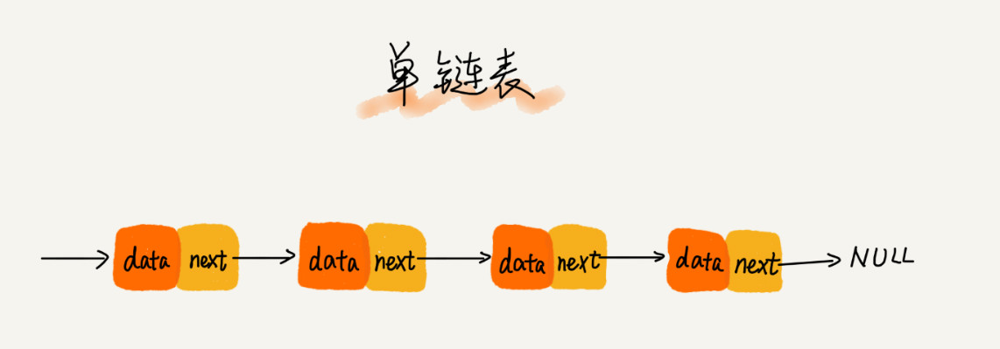

**相比[数组](https://cnxiekun.github.io/2020/02/25/%E6%95%B0%E7%BB%84/)，链表是一种稍微复杂一点的数据结构。**

## 链表结构

从**底层的存储结构**来看，数组需要一块**连续的内存空间**来存储，对内存的要求比较高。如果申请一个 100MB 大小的数组，当内存中没有连续的、足够大的存储空间时，即便内存的剩余总可用空间大于 100MB，仍然会申请失败。

链表恰恰相反，它并不需要一块连续的内存空间，它通过“指针”将一组**零散的内存块**串联起来使用。所以如果申请的是 100MB 大小的链表，根本不会有问题。

三种最常见的链表结构，它们分别是：`单链表`、`双向链表` 和 `循环链表`。

<!--more-->

### 单链表

链表通过指针将一组零散的内存块串联在一起，称内存块为链表的“**结点**”。为了将所有的结点串起来，每个链表的结点除了存储数据之外，还需要记录链上的下一个结点的地址。如图所示，记录下个结点地址的指针叫作**后继指针 `next`**。

有两个结点比较特殊，第一个结点——**`头结点`** 和最后一个结点——**`尾结点`**。头结点用来记录链表的基地址,可以用来遍历得到整条链表。尾结点的指针不是指向下一个结点，而是指向一个**空地址 `NULL`**，表示这是链表上最后一个结点。

与数组一样，链表也支持数据的查找、插入和删除操作。在进行数组的插入、删除操作时，为了保持内存数据的连续性，需要做大量的数据搬移，所以时间复杂度是 $O(n)$。而在链表中插入或者删除一个数据，并不需要为了保持内存的连续性而搬移结点，因为链表的存储空间本身就不是连续的。所以，在链表中插入和删除一个数据是非常快速的。

从下图可以看出，针对链表的插入和删除操作，只需要考虑相邻结点的指针改变，所以对应的时间复杂度是 $O(1)$。

但是，有利就有弊。链表要想随机访问第 $k$ 个元素，没有数组那么高效。因为链表中的数据并非连续存储的，所以无法像数组那样，根据首地址和下标，通过寻址公式就能直接计算出对应的内存地址，而是需要根据指针一个结点一个结点地依次遍历，直到找到相应的结点。所以，链表随机访问的性能没有数组好，需要 $O(n)$ 的时间复杂度。

### 循环链表

一种特殊的单链表，它跟单链表唯一的区别就在尾结点。循环链表的尾结点指针是指向链表的头结点，它像一个环一样首尾相连，所以叫作“循环”链表。

和单链表相比，循环链表的优点是从链尾到链头比较方便。当要处理的数据具有环型结构特点时，就特别适合采用循环链表。比如著名的[约瑟夫问题](https://zh.wikipedia.org/wiki/%E7%BA%A6%E7%91%9F%E5%A4%AB%E6%96%AF%E9%97%AE%E9%A2%98)。尽管用单链表也可以实现，但是用循环链表实现的话，代码就会简洁很多。

### 双向链表

单向链表只有一个方向，结点只有一个后继指针 `next` 指向后面的结点。而双向链表，它支持两个方向，每个结点不止有一个后继指针 `next` 指向后面的结点，还有一个前驱指针 `prev` 指向前面的结点。

双向链表需要额外的两个空间来存储后继结点和前驱结点的地址。所以，如果存储同样多的数据，双向链表要比单链表占用更多的内存空间。虽然两个指针比较浪费存储空间，但可以支持双向遍历，这样也带来了双向链表操作的灵活性。

从结构上来看，双向链表可以支持 $O(1)$ 时间复杂度的情况下找到前驱结点，正是这样的特点，也使双向链表在某些情况下的插入、删除等操作都要比单链表简单、高效。

**用空间换时间**的设计思想：当内存空间充足的时候，如果追求代码的执行速度，可以选择空间复杂度相对较高、但时间复杂度相对很低的算法或者数据结构。相反，如果内存比较紧缺，就要反过来用时间换空间的设计思路。

> 对于执行较慢的程序，可以通过消耗更多的内存（空间换时间）来进行优化；而消耗过多内存的程序，可以通过消耗更多的时间（时间换空间）来降低内存的消耗。

**Remark**: 把循环链表和双向链表整合在一起：**双向循环链表**。

## 链表 VS 数组性能比较

数组和链表是两种截然不同的内存组织方式。正是因为内存存储的区别，它们插入、删除、随机访问操作的时间复杂度正好相反。

数组简单易用，在实现上使用的是连续的内存空间，可以借助 CPU 的缓存机制，预读数组中的数据，所以访问效率更高。而链表在内存中并不是连续存储，所以对 CPU 缓存不友好，没办法有效预读。

数组的缺点是大小固定，一经声明就要占用整块连续内存空间。如果声明的数组过大，系统可能没有足够的连续内存空间分配给它，导致“内存不足（out of memory）”。如果声明的数组过小，则可能出现不够用的情况。这时只能再申请一个更大的内存空间，把原数组拷贝进去，非常费时。链表本身没有大小的限制，天然地支持动态扩容，这也是它与数组最大的区别。

> Java 中的 ArrayList 容器，可以支持动态扩容。但往支持动态扩容的数组中插入一个数据时，如果数组中没有空闲空间了，就会申请一个更大的空间，将数据拷贝过去，而数据拷贝的操作非常耗时。

如果代码对内存的使用非常苛刻，那数组更适合。因为链表中的每个结点都需要消耗额外的存储空间去存储一份指向下一个结点的指针，所以内存消耗会翻倍。而且，对链表进行频繁的插入、删除操作，还会导致频繁的内存申请和释放，容易造成内存碎片，如果是 Java 语言，就有可能会导致频繁的 GC（Garbage Collection，垃圾回收）。所以，在实际的开发中，针对不同类型的项目，要根据具体情况，权衡究竟是选择数组还是链表。

## 如何基于链表实现 LRU (最少使用策略, Least Recently Used) 缓存淘汰算法？

缓存实际上就是利用了空间换时间的设计思想，如果把数据存储在硬盘上，会比较节省内存，但每次查找数据都要询问一次硬盘，会比较慢。但如果通过缓存技术，事先将数据加载在内存中，虽然会比较耗费内存空间，但是每次数据查询的速度就大大提高了。

思路：维护一个有序单链表，越靠近链表尾部的结点是越早之前访问的。当有一个新的数据被访问时，从链表头开始顺序遍历链表。

1. 如果此数据之前已经被缓存在链表中了，遍历得到这个数据对应的结点，并将其从原来的位置删除，然后再插入到链表的头部。
2. 如果此数据没有在缓存链表中，可以分为两种情况：
    - 如果此时缓存未满，则将此结点直接插入到链表的头部
    - 如果此时缓存已满，则链表尾结点删除，将新的数据结点插入链表的头部。

> 参考资料：[王争——数组：为什么很多编程语言中数组都从0开始编号？](https://time.geekbang.org/column/article/41013)
